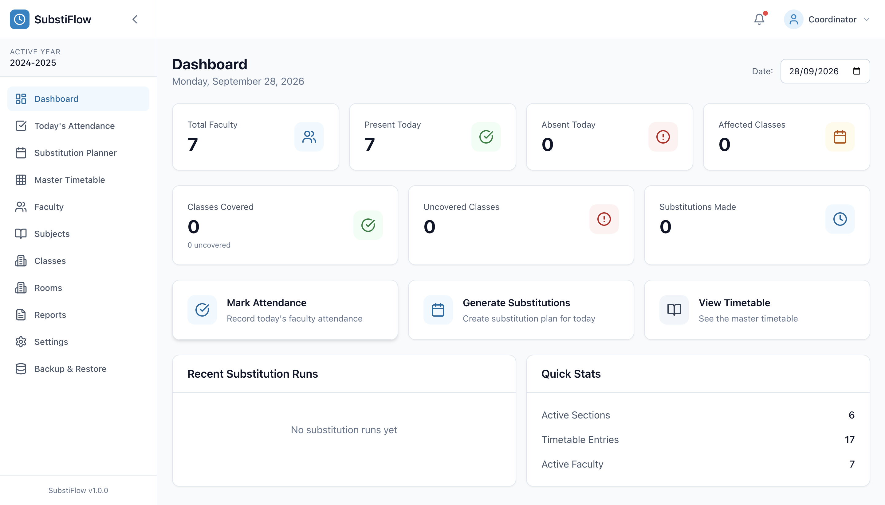

# SubstiFlow

**Faculty Timetable & Automatic Substitution Manager** — a fully offline Windows desktop
application for managing college timetables, daily faculty attendance and
automatic, rule-based substitution planning.

SubstiFlow never talks to the network. All data lives in a local SQLite database
inside your app-data folder, and the substitution engine is a deterministic,
explainable scoring algorithm — the same input always produces the same plan.



---

## Table of contents

1. [Features](#features)
2. [Tech stack](#tech-stack)
3. [Prerequisites](#prerequisites)
4. [Install](#install)
5. [Run in development](#run-in-development)
6. [Build / package for Windows](#build--package-for-windows)
7. [Automated tests](#automated-tests)
8. [First-run setup](#first-run-setup)
9. [Daily use](#daily-use)
10. [How the substitution algorithm works](#how-the-substitution-algorithm-works)
11. [Configuration](#configuration)
12. [Import / export](#import--export)
13. [Backup & restore](#backup--restore)
14. [Database schema](#database-schema)
15. [Project structure](#project-structure)
16. [Troubleshooting](#troubleshooting)

---

## Features

- **Dashboard** — today's absences, plan status, coverage statistics.
- **Today's Attendance** — everyone defaults to *Present*; mark absent/present per
  faculty, bulk controls, per-department filter.
- **Substitution Planner** — generate a plan for a date, review every suggestion
  with its score and human-readable reasoning, edit, lock/unlock, approve, publish.
- **Master Timetable** — weekly grid per section (and per faculty view), add/edit
  entries with conflict validation.
- **Faculty / Subjects / Classes / Rooms** — full CRUD with relations
  (faculty ⇄ subjects, faculty ⇄ sections).
- **Reports** — substitution history, per-faculty substitution counts, coverage,
  CSV/Excel export, print/PDF.
- **Settings** — working hours, break window, daily substitution limit, scoring
  weights, institution details.
- **Backup & Restore** — one-click export/import of the SQLite file, plus automatic
  daily backups.
- **CSV / Excel import & export** (via `xlsx`).
- **Print / PDF** through Electron's `printToPDF`.
- **First-run 10-step setup wizard** that creates a usable dataset in minutes.
- **Timetable validation** with human-readable error messages
  (e.g. *"Mrs. Usha is already teaching I BCA-A at 12:00–13:00"*).

### Hard constraints (always enforced)

| # | Constraint |
|---|------------|
| 1 | An absent teacher is **never** assigned as a substitute |
| 2 | No teacher is ever double-booked (same day/slot) |
| 3 | No substitutions inside the lunch break |
| 4 | Substitutes only within configured working hours |
| 5 | Daily substitution limit per faculty (default **2**) |
| 6 | The master timetable is **never mutated** by substitution |
| 7 | A section is never given two teachers in one slot |
| 8 | A room is never double-booked |
| 9 | If no valid candidate exists the class shows **NO SUBSTITUTE FOUND** |

---

## Tech stack

| Layer | Technology |
|-------|-----------|
| Shell | Electron 31 |
| UI | React 18 + TypeScript (strict) + Vite 5 |
| Styling | Tailwind CSS 3 |
| Forms | React Hook Form + Zod |
| State | Zustand |
| Database | SQLite via `better-sqlite3` (WAL, foreign keys) |
| Spreadsheets | `xlsx` |
| Tests | Vitest |
| Packaging | `electron-builder` (NSIS, Windows x64) |

---

## Prerequisites

- **Node.js ≥ 18** (developed against Node 20 LTS) and npm.
- Windows 10/11 x64 for the final installer; macOS/Linux work for development.

```bash
node -v   # >= v18
npm -v
```

> If you keep a portable Node build, export it before running npm:
> ```bash
> export PATH="$HOME/.local/node-v20.17.0-darwin-arm64/bin:$PATH"
> ```

---

## Install

```bash
npm install
```

`postinstall` then makes the toolchain ready:

- downloads the Electron runtime if it is missing
- applies an ad-hoc code signature to `Electron.app` (macOS refuses to run — and
  will silently delete — app bundles with a missing/invalid signature)
- rebuilds `better-sqlite3` against Electron's headers so the native ABI matches

Re-run it at any time:

```bash
npm run postinstall
```

If the Electron runtime itself is missing or corrupt:

```bash
node node_modules/electron/install.js
codesign --force --deep --sign - node_modules/electron/dist/Electron.app   # macOS only
```

### Native module ABI

`better-sqlite3` is a native addon, so it only works in the runtime it was
compiled for. SubstiFlow needs three different builds of it:

| Target        | Used by                     | Command                          |
| ------------- | --------------------------- | -------------------------------- |
| Node (host)   | `npm test` (Vitest)         | `node scripts/ensure-abi.js node`     |
| Electron      | `npm run dev`, `db:seed`    | `node scripts/ensure-abi.js electron` |
| Windows x64   | `npm run dist` (installer)  | `node scripts/ensure-abi.js win32`    |

Every entry point declares the target it needs through an npm `pre` script, and
a stamp file (`node_modules/.substiflow-abi-stamp`) records what is currently in
place — switching is a no-op when the stamp already matches.

The Windows target downloads the **published win32-x64 prebuild** for our
Electron ABI instead of compiling, which is what makes it possible to produce a
Windows installer from macOS or Linux. After packaging, the next `npm test` or
`npm run dev` automatically restores the right host binary.

---

## Run in development

```bash
npm run dev
```

This will, in order:

1. compile the Electron main process (`tsc -p tsconfig.electron.json`)
2. copy `src/db/schema.sql` next to the compiled output
3. start the Vite dev server on `http://localhost:5173`
4. launch Electron pointing at that server with DevTools open

Individual pieces:

```bash
npm run dev:vite       # renderer only (browser)
npm run dev:electron   # Electron shell only (expects Vite to be running)
npm run build:electron # compile main + preload and copy assets
```

### Optional: seed the BCA sample dataset

```bash
npm run db:migrate     # create/upgrade the local SQLite database
npm run db:seed        # load the sample BCA college data
```

Both run **inside Electron** (`electron scripts/cli.js …`) so they use the same
native-module ABI and the exact same storage folder as the app.

The seed creates Ranjini, Keerthi, Usha, Kohila, Kunkumashri,
Dr. Geetha Lakshmi and Mr. Sheethal with sections I BCA-A … III BCA-B and a
Wednesday timetable. Try marking **Mrs. Ranjini** absent on Wednesday and
generating the plan — III BCA-B 12:00–13:00 (Probability & Statistics) is
assigned to **Mrs. Usha** (same class).

---

## Build / package for Windows

```bash
npm run build          # renderer (vite) + main process (tsc) + assets
npm run dist           # build + electron-builder --win --x64
```

Output: `dist-electron/SubstiFlow-Setup.exe`

Other targets:

```bash
npm run dist:dir       # unpacked folder build (fast, no installer)
npx electron-builder --win --x64 --portable
npx electron-builder --win --x64 --dir
```

Other useful scripts:

```bash
npm run icon           # regenerate public/icon.png + public/icon.ico
npm run postinstall    # re-download/sign Electron and rebuild native modules
npm run typecheck      # tsc --noEmit
```

> **Building Windows installers from macOS**
>
> electron-builder edits the `.exe` resources with `rcedit`, which runs under
> Wine. On Apple Silicon Macs that requires **Rosetta 2**:
>
> ```bash
> softwareupdate --install-rosetta --agree-to-license
> ```
>
> Building on a Windows machine is still the recommended path (no Wine, no
> Rosetta, native NSIS tooling).

---

## Automated tests

```bash
npm test               # single run
npm run test:watch     # watch mode
npm run typecheck      # tsc --noEmit
```

`src/services/substitution/__tests__/engine.test.ts` covers the required
scenarios:

1. Same-class priority — Ranjini absent ⇒ III BCA-B gets **Usha**
2. Unavailable cascade — next same-class teacher is selected
3. Fall-through to a same-department teacher
4. Candidate already teaching in that slot ⇒ rejected
5. Candidate absent ⇒ rejected
6. Candidate at the daily substitution limit ⇒ rejected
7. Two absent teachers ⇒ each slot gets a **unique** substitute
8. No valid candidate ⇒ **NO SUBSTITUTE FOUND**
9. Break slot is never substituted
10. Global conflict-free optimization (no double-booking)
11. Locked manual assignment is preserved
12. Determinism — identical input ⇒ identical output

Plus scoring-level assertions (ranking, rejection reasons, custom limits).

`hard-constraints.test.ts` covers the **manual override** path — an
assignment written outside generation must satisfy the same hard constraints
as the generated plan:

1. Eligibility — an unqualified, cross-department teacher is still offered the
   slot (qualification only changes the *score*; nothing is excluded by subject)
2. Absent and already-teaching teachers never appear as candidates
3. The same-class teacher ranks first
4. The engine refuses a teacher already covering another class in that slot
5. A hand-picked substitute who is teaching in that slot ⇒ rejected
6. A hand-picked absent teacher ⇒ rejected
7. A hand-picked teacher already covering another class in that slot ⇒ rejected
8. A hand-picked teacher at the daily limit ⇒ rejected
9. A legitimate override still succeeds

---

## First-run setup

On the very first launch the app shows a **10-step wizard**:

1. Institution details
2. Academic year
3. Departments
4. Working hours & break window
5. Time slots
6. Classes / sections
7. Subjects
8. Faculty
9. Faculty ⇄ subject & faculty ⇄ section mapping
10. Master timetable (import or manual entry) → *Finish*

Setup can be re-run any time from **Settings → Re-run setup**. Skipping steps is
allowed; the app will tell you exactly what is still missing.

---

## Daily use

1. **Open SubstiFlow** — the Dashboard shows today's date and plan status.
2. **Today's Attendance** — everyone is *Present* by default; mark the absentees.
3. **Substitution Planner → Generate plan** for today.
4. **Review** each suggestion: substitute, score, reasoning. Edit or **lock**
   anything you disagree with.
5. **Approve** the plan (status becomes `APPROVED`), then **Publish**.
6. **Print / Export** the revised timetable (PDF or Excel) and share it.
7. The **master timetable is unchanged** — tomorrow's plan starts from scratch.

Regenerating after approval only replaces *unlocked* assignments; anything you
locked is preserved.

---

## How the substitution algorithm works

Implementation: `src/services/substitution/`

```
engine.ts    – builds availability, solves the problem, persists runs
scoring.ts   – hard-constraint gate + weighted scoring + reasoning strings
types.ts     – internal problem/candidate/solution types
index.ts     – public API used by the UI
```

### 1. Build the problem

- Which faculty are absent today (from `attendance`).
- Which master-timetable entries are affected (their teacher is absent) —
  filtered to teaching slots inside working hours and never the break slot.
- Every active faculty member, every time slot, and the configured weights.

### 2. Build availability

For each faculty member:

- `busySlots` — the slots in which they already teach that day (from the master
  timetable) **plus** slots they are already assigned to as a substitute in the
  current run.
- `substitutionCount` — how many substitutions they already have today
  (approved/locked ones count towards the daily limit).
- Absent faculty are excluded up-front.

### 3. Hard-constraint gate

A candidate is rejected outright (never scored) if any of these hold:

- absent today
- busy in that slot (would double-book)
- already at the daily substitution limit
- the entry is in the break slot
- outside working hours
- already locked to somebody else for that entry

### 4. Weighted scoring

Default weights (configurable in **Settings**):

| Signal | Weight |
|--------|-------:|
| Teaches the same class (section) | **+100** |
| Same semester | +60 |
| Same department | +40 |
| Qualified for the subject | +30 |
| Teaches the same subject | +20 |
| Free during the slot | +20 |
| Low substitution count today | +15 |
| Has taught this section before | +10 |
| Cross-department penalty | −50 |
| High substitution count penalty | −30 |
| Consecutive-slot fatigue penalty | −20 |

Priority hierarchy (the defaults naturally encode it):

`P1 same class → P2 same semester → P3 same department → P4 subject qualified → P5 cross-department`

### 5. Global conflict-free assignment

Candidates are ranked for every uncovered entry; entries with the **fewest**
candidates are assigned first (most-constrained-first). Assignments are made
greedily, and every accepted assignment immediately tightens availability for
the remaining entries — so one teacher is never booked into two classes at the
same time, even across different absences.

### 6. Explainability

Each assignment stores a `reasoning` string, e.g.

> `Score: 215 | Normally teaches III BCA-B (+100), Same department (+40),
> Qualified for Probability & Statistics (+30), Free during slot (+20),
> Low substitution load (+15), Taught this section before (+10)`

### 7. Determinism

- Faculty are processed in a stable order (by name).
- Candidates are sorted by score with a stable sort, ties broken by faculty id.
- Identical input ⇒ byte-identical plan (covered by Test 12).

### 8. No valid candidate

The entry is recorded as *uncovered* and the UI shows
**NO SUBSTITUTE FOUND** with the reason (`No eligible faculty available`).

---

## Configuration

**Settings** exposes:

| Setting | Default | Where it lives |
|---------|---------|----------------|
| Working hours | 09:00 – 16:00 | `application_settings.working_hours_*` |
| Break | 13:00 – 14:00 | `application_settings.break_*` |
| Time slots | 6 teaching slots + break | `time_slots` |
| Daily substitution limit | 2 | `application_settings.max_daily_substitutions` and per-faculty `max_daily_substitutions` |
| Scoring weights | see table above | `substitution_rules` (defaults from `DEFAULT_SUBSTITUTION_WEIGHTS`) |

All values are read at plan-generation time, so changing a weight immediately
affects the next plan.

---

## Import / export

- **Timetable** — CSV / Excel import & export (`xlsx`) from *Master Timetable*.
- **Faculty, Subjects, Classes, Rooms** — CSV export from each list page.
- **Reports** — substitution history exported to CSV/Excel.
- **Print / PDF** — every major screen has a print action that renders a clean
  document and saves a PDF through Electron.

Import errors are reported per row in plain language, e.g.
`Row 12: unknown subject code "BCA-399"`.

---

## Backup & restore

**Backup & Restore** page:

- **Export backup** — saves a copy of the SQLite database (`.db`) anywhere you
  choose. The copy is made with SQLite's online backup API, so it is safe to
  export while the app is running.
- **Import backup** — selects a `.db` file, warns that current data will be
  overwritten, replaces the file and reopens the database.
- **Automatic backups** — every launch writes a dated snapshot
  (`auto-backups/substiflow-YYYY-MM-DD.db`) next to the database, at most one
  per day, keeping the newest 14 and pruning older ones. The **Backup & Restore**
  page shows where the snapshots are and when the last one was taken.

The database lives at:

| OS | Path |
|----|------|
| Windows | `%APPDATA%\SubstiFlow\database\substiflow.db` |
| macOS | `~/Library/Application Support/SubstiFlow/database/substiflow.db` |
| Linux | `$XDG_DATA_HOME/SubstiFlow/database/substiflow.db` |

Override with the `SUBSTIFLOW_DATA_DIR` environment variable.

---

## Database schema

Source of truth: [`src/db/schema.sql`](src/db/schema.sql).

Tables: `academic_years`, `departments`, `faculty`, `subjects`, `sections`,
`rooms`, `time_slots`, `timetable_entries`, `faculty_subjects`,
`faculty_sections`, `attendance`, `substitution_rules`, `substitution_runs`,
`substitution_assignments`, `application_settings`, `schema_version`.

- Foreign keys are enforced (`PRAGMA foreign_keys = ON`).
- `journal_mode = WAL`.
- Schema versioning is tracked in `schema_version`; forward-only migrations run
  automatically at startup (see `runMigrations` in `src/db/nodeDb.ts`).
- Uniqueness guarantees at the DB level:
  `timetable_entries(academic_year, day, slot, section)`,
  `(..., slot, faculty)`, `(..., slot, room)` — a broken timetable cannot even
  be stored.

---

## Project structure

```
├── electron/                # main process + preload bridge
│   ├── main.ts              # window, IPC handlers, backup, print/PDF
│   └── preload.ts           # contextBridge API (window.electron)
├── scripts/
│   ├── cli.js               # entry for db:migrate / db:seed (runs inside Electron)
│   ├── tasks/
│   │   ├── migrate.js       # create/upgrade the local database
│   │   └── seed.js          # BCA sample dataset
│   ├── seed.js              # BCA sample dataset (data + inserts)
│   ├── copy-assets.js       # copies schema.sql next to compiled output
│   ├── ensure-abi.js        # switches better-sqlite3 between Node/Electron/Windows
│   ├── make-icon.js         # regenerates public/icon.png + icon.ico (no deps)
│   └── postinstall.js       # Electron download, ad-hoc sign, native rebuild
├── src/
│   ├── components/          # UI primitives (Button, Table, Dialog, …) + layout
│   ├── db/
│   │   ├── schema.sql       # schema source of truth
│   │   ├── nodeDb.ts        # better-sqlite3 driver (main process / Node)
│   │   ├── ipcDb.ts         # renderer driver over synchronous IPC
│   │   ├── nodeDb.browser.ts# stub aliased in for the browser bundle
│   │   ├── database.ts      # getDatabase() picks the right driver
│   │   └── repositories/    # typed data access for every table
│   ├── pages/               # one file per sidebar screen
│   ├── services/
│   │   └── substitution/    # deterministic engine + tests
│   ├── stores/              # Zustand stores
│   ├── types/               # domain models (Zod-friendly) + electron globals
│   └── utils/
├── docs/                    # PRD
├── vite.config.ts           # aliases @/ and the browser stub for nodeDb
├── vitest.config.ts
├── tsconfig.json            # renderer (strict)
└── tsconfig.electron.json   # main process (CommonJS output)
```

### Architecture note

The renderer **never** imports Node/Electron modules. Repositories call
`getDatabase()`, which resolves to:

- `ipcDb.ts` inside the renderer → synchronous `ipcRenderer.sendSync` calls →
  main process executes SQL on the single `better-sqlite3` connection.
- `nodeDb.ts` under Node (scripts, migrations).

`vite.config.ts` aliases `@/db/nodeDb` to `nodeDb.browser.ts`, so
`better-sqlite3` and `electron` are guaranteed to stay out of the browser bundle
while repositories keep a synchronous API.

---

## Troubleshooting

| Symptom | Fix |
|---------|-----|
| `Module "fs" has been externalized … imported by …electron/index.js` | Renderer is importing a Node-only module. Check that no page imports `src/db/nodeDb` directly; rebuild with `npm run build`. |
| `spawn …/Electron ENOENT` | Electron binary missing — run `node node_modules/electron/install.js`. |
| `The border-… class does not exist` | A Tailwind colour scale is incomplete — extend `tailwind.config.js`. Interpolated names (`bg-${x}-50`) are never generated; use full class strings instead. |
| `Could not locate schema.sql` | Run `npm run build:electron` (it copies the schema), or run from the project root. |
| `table … has no column named …` | Run `npm run db:migrate`; if the DB predates a schema change, delete it (backup first) so the schema is recreated. |
| App opens blank | Run with `npm run dev`. `electron .` on its own loads the **built** renderer, so run `npm run build` first if `dist/renderer` is stale. |
| `NODE_MODULE_VERSION … does not match` | The native module is built for the wrong runtime — `node scripts/ensure-abi.js electron` (app) or `node scripts/ensure-abi.js node` (tests). `npm test` / `npm run dev` do this automatically. |
| Plan always shows *NO SUBSTITUTE FOUND* | Everyone is either absent, busy, or at the daily limit — check Attendance and the daily limit in Settings. |
| Native module errors after upgrading Node/Electron | `node scripts/ensure-abi.js electron`, or reinstall and run `npm run postinstall`. |

---

## License

MIT
