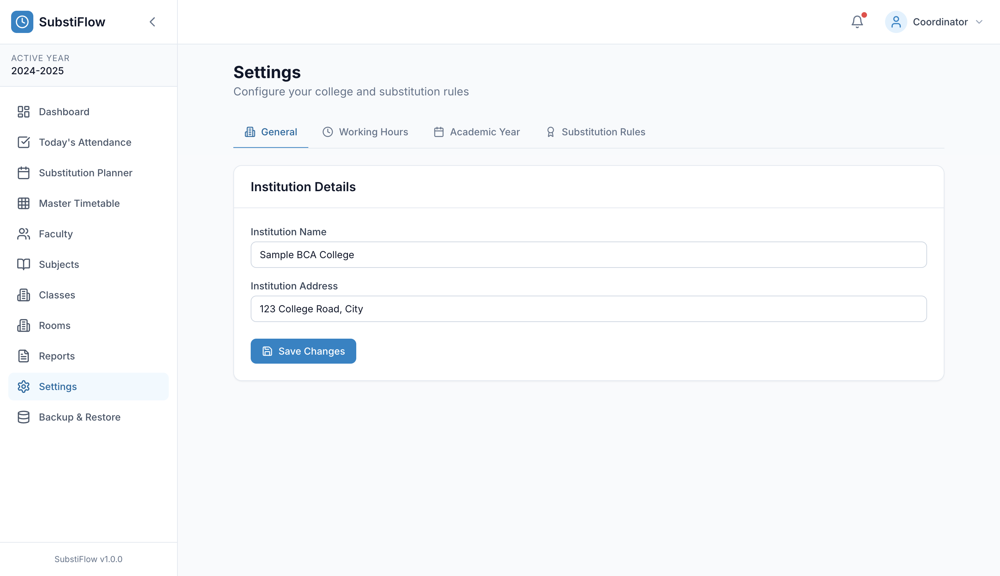

# SubstiFlow

Offline-first college timetable and faculty-substitution management system for coordinators. A desktop application built with Electron, React, TypeScript, and SQLite.

## Overview

Every working day, a college coordinator faces the same chain of problems: a faculty member is absent, certain classes are affected, someone has to cover them, and the day's timetable has to be reissued — correctly, explainably, and before the next period starts.

SubstiFlow manages that workflow end to end:

- **Master timetable** — weekly grid of activities per class section: subject, faculty (or faculty team), room, period, and activity type (lecture, lab, tutorial, and other non-teaching types).
- **Attendance** — mark faculty present or absent for a given date; affected activities are identified automatically.
- **Substitution generation** — an engine proposes a substitute for every affected activity, excluding unavailable faculty through hard constraints, ranking the rest by a priority hierarchy (P1–P5) and a transparent weighted score.
- **Review, approve, lock** — a coordinator reviews the plan, overrides assignments when needed, approves it, and locks individual assignments so regeneration cannot disturb them.
- **Revised timetable** — the day's timetable is reissued showing Original Faculty → Substitute Faculty for every replaced activity, leaving the master timetable untouched.
- **Audit trail** — attendance marks, generated plans, overrides, locks, approvals, and timetable edits are recorded with real timestamps.

The application runs entirely on the local machine: data lives in a SQLite file next to the app, there is no server component, and no network access is required to use it. That is a deliberate architectural choice, not a limitation — coordinators work on college desktops where availability and data ownership matter more than sync.

## Key Features

All of the following are implemented in the current codebase and covered by tests where noted:

- **Master timetable management** — week grid with add/edit/delete, quick entry from a cell, and conflict detection (time overlap, span crossing another activity, room double-booking).
- **Multi-faculty activities** — an activity can have an ordered team of faculty (e.g. lab sessions shared by several staff), with join-table persistence.
- **Multi-period activities** — an activity spans one or more consecutive periods (2-hour labs are a single activity, not two entries).
- **Activity types** — `LECTURE`, `LAB`, `TUTORIAL`, `LIBRARY`, `MENTORING`, `SKILL_BUILD`, `COE`, `OTHER`; lecture and lab require at least one faculty member, other types may legitimately have none.
- **Faculty/subject qualifications** — subjects qualified per faculty, sections taught per faculty; both feed the substitution ranking.
- **Attendance** — per-date present/absent marking; absent faculty drive the substitution problem.
- **Automatic substitution generation** — deterministic engine proposing a substitute per affected activity, with an explicit `uncovered` state when nobody qualifies.
- **P1–P5 substitution priority** — tiered candidate ranking (see [How Substitution Works](#how-substitution-works)).
- **Hard constraints** — absent, already teaching (span-aware), daily substitution limit, break period, outside working hours. Always enforced, never traded off by scoring.
- **Multi-faculty substitution policies** — `TEAM_SUFFICIENT` (remaining team keeps the class running) or `REPLACE_ABSENT` (generate a substitute covering only the absent member's part), configurable in Settings.
- **Manual override with validation** — the assignment picker only offers candidates that pass the same hard-constraint checks as generation; invalid picks are refused with a specific reason.
- **Run lifecycle** — `GENERATED` → reviewed (all covered / review required) → `APPROVED` → `LOCKED`; editing an approved plan reopens it for review.
- **Assignment locking** — locked assignments survive regeneration and refuse substitute changes at the service layer.
- **Revised timetable** — daily view of normal classes and substitutions side by side, with Original → Substitute and lock state per row.
- **Approval audit** — approval records timestamp and approving user.
- **Audit trail** — append-only log of meaningful actions (attendance, generation, overrides, lock/unlock, approval, timetable changes).
- **Academic year and effective terms** — academic years with dated terms; the dashboard and master timetable show which term is currently effective.
- **Backup & restore** — manual export/import with SQLite validation and a confirmation step, plus automatic per-launch-day snapshots that are pruned to a fixed retention count.
- **CSV and Excel export** — revised timetable CSV, daily substitution report CSV, and `.xlsx` export from the Reports page.
- **Printing** — print the revised timetable / substitution report through the native print dialog (PDF save supported by the same code path).
- **Offline/local SQLite storage** — WAL mode, foreign keys enforced, forward-only migrations.
- **Electron desktop application** — packaged as a Windows NSIS installer (`SubstiFlow-Setup.exe`).
- **First-run setup wizard** — institution details, academic year, working hours, and base data before first use.

## Why SubstiFlow?

Spreadsheet-based substitution tracking fails in predictable ways: constraints are remembered rather than enforced, "why this substitute?" has no answer, and the revised timetable drifts out of sync with the master. SubstiFlow encodes the constraints instead:

- The **hard constraints** are the same code path for automatic generation and manual picks, so a coordinator cannot assign what the engine would refuse.
- Every substitution carries its **reasons** (`✓ normally teaches III BCA-B`, `✓ same department`, …), so the decision is explainable rather than opaque.
- The **master timetable is never mutated** by attendance, generation, approval, or locking. The revised day view is derived; the source of truth stays intact.
- Ranking is **deterministic**: the same inputs always produce the same plan (tier first, then score, stable ordering), which makes results reproducible and testable.

## How Substitution Works

1. **Faculty attendance** — the coordinator marks absent faculty for the date.
2. **Identify affected activities** — timetable activities whose faculty team includes an absent member. For multi-faculty activities the configured policy decides whether a partially-absent team is affected at all (`TEAM_SUFFICIENT`: the remaining team continues; `REPLACE_ABSENT`: the absent member's part needs coverage).
3. **Remove unavailable candidates** — inactive, absent, and busy faculty are dropped; availability is span-aware (a substitute busy in either hour of a 2-hour lab is unavailable), and the per-faculty daily substitution limit is enforced.
4. **Check hard constraints** — a candidate surviving step 3 must also clear: not absent, not teaching in any covered slot, under the daily limit, not during a break, and within configured working hours.
5. **Apply priority tiers** — each surviving candidate gets one tier:
   - **P1** — normally teaches the affected class/section
   - **P2** — normally teaches the same semester/year
   - **P3** — same department and teaches other classes
   - **P4** — otherwise related (subject qualification, class history, department)
   - **P5** — unrelated faculty (considered only when Settings allows unrelated substitutions)
6. **Rank valid candidates** — sort by tier first, then by weighted score descending (same class, same semester, same department, subject qualification, free slot, low daily load, prior teaching of the section, minus penalties for near-limit load and consecutive slots). Ties resolve deterministically.
7. **Explain the selection** — each assignment stores a score and a human-readable reasoning string, and the UI renders the full `✓` reason checklist per card. Activities with no valid candidate are persisted as **uncovered** with the attempted candidates and reasons.
8. **Review** — the Substitution Planner shows every assignment with Original Faculty, Substitute, score, reasons, and policy context; manual overrides are validated against the same constraints.
9. **Approve** — the run is approved with timestamp and user; approval status is visible in the UI.
10. **Lock** — individual assignments can be locked; locked assignments are preserved across regeneration and reject substitute changes (UI control disabled, service layer refuses the update with an explicit message).
11. **Generate revised timetable** — the Revised Timetable page shows the reissued day: normal classes and substitutions, each replacement as Original Faculty → Substitute Faculty, with lock state.

Details and diagrams: [docs/SUBSTITUTION_ENGINE.md](docs/SUBSTITUTION_ENGINE.md).

## Screenshots

Dashboard — the coordinator's morning view (sample data):


Settings — institution, working hours, academic year, and substitution rules:



## Architecture

```
┌────────────────────────── Electron main process ──────────────────────────┐
│  window management · IPC handlers (sender-verified) · backup export/import │
│  native print / PDF · auto-backups            electron/main.ts             │
└───────────────▲───────────────────────────────────────────────────────────┘
                │ contextBridge (preload: db / backup / app / print)
                │ electron/preload.ts
┌───────────────┴───────────── renderer ────────────────────────────────────┐
│  React pages (Dashboard, Attendance, Planner, Revised Timetable, …)        │
│  Zustand app store · UI components                                         │
│            │                                                               │
│  Application services                                                      │
│    src/services/timetable     validation · conflict detection · CRUD       │
│    src/services/substitution  engine · scoring · run lifecycle             │
│            │                                                               │
│  Repositories (src/db/repositories) — one per aggregate, parameterised SQL │
│            │                                                               │
│  SQLite access layer (src/db/database.ts)                                 │
│    renderer → IPC bridge · Node/tests → direct file                        │
└───────────────┬───────────────────────────────────────────────────────────┘
                │ better-sqlite3 (WAL, foreign keys ON)
        SQLite database (application data / database / substiflow.db)
```

```
attendance ──► affected activities ──► candidate pool ──► hard constraints
                                                        │ (reject: absent / busy /
                                                        │  daily limit / break /
                                                        │  working hours)
                                                        ▼
                                              priority tier P1–P5
                                                        ▼
                                              weighted score ranking
                                                        ▼
                                   assignments + uncovered (with reasons)
                                                        ▼
                                   review ──► approve ──► lock ──► revised timetable
```

More detail: [docs/ARCHITECTURE.md](docs/ARCHITECTURE.md).

## Tech Stack

| Layer | Technology |
|---|---|
| Desktop shell | Electron 31 |
| UI | React 18, TypeScript 5.6, Tailwind CSS 3 |
| Routing / state | React Router 6, Zustand |
| Forms / validation | react-hook-form, Zod |
| Database | SQLite via better-sqlite3 (WAL, foreign keys) |
| Exports | native CSV writer, `xlsx` (Excel) |
| Build | Vite 5, `tsc` (Electron main), electron-builder 24 |
| Tests | Vitest 2 |

No cloud services, no telemetry, no network calls at runtime.

## Project Structure

```
electron/            main process: window, IPC, backup, print, auto-backup
src/
  pages/             route-level screens (dashboard … backup)
  components/        layout + reusable UI primitives
  services/
    timetable/       validation, conflict detection, entry CRUD, quick entry
    substitution/    engine, scoring, run lifecycle, lock/approval rules
  db/
    repositories/    one repository per aggregate (parameterised SQL)
    migrations.ts    forward-only migrations (schema v3)
    schema.sql       base schema
  stores/            Zustand app store
  types/             shared domain types
  __tests__/         regression, product-model, migration, live-workflow, …
scripts/             postinstall, ABI stamping, migration/seed CLI, assets
docs/                architecture, data model, engine, testing, security, release
```

## Getting Started

Requirements: Node.js 20+ and npm.

```bash
git clone https://github.com/skandachandrashekar335-wq/SUBSTIFLOW.git
cd SUBSTIFLOW
npm install     # downloads Electron, applies macOS ad-hoc signature, rebuilds the native module
npm run dev     # Vite dev server + Electron with hot reload
```

Other scripts (all defined in `package.json`):

| Command | What it does |
|---|---|
| `npm test` | Run the Vitest suite (stamps the native module for Node first) |
| `npm run test:watch` | Vitest in watch mode |
| `npm run typecheck` | `tsc --noEmit` for the renderer/app code |
| `npm run build` | Production renderer bundle (Vite) + Electron main (`tsc`) |
| `npm run dist` | Full build + Windows x64 NSIS installer into `dist-electron/` |
| `npm run db:migrate` | Run pending database migrations from the CLI |
| `npm run db:seed` | Load the optional sample BCA dataset |
| `npm run preview` | Preview the production renderer bundle |

**Development vs production:** in development the renderer is served by Vite on `localhost:5173` and Electron loads that URL; in a packaged build Electron loads the built files from `dist/`. Both use the same SQLite database, so migrations and behaviour are identical.

**Native module note:** `better-sqlite3` must match the runtime ABI. `scripts/ensure-abi.js` stamps it automatically before dev, test, and packaging (`predev`, `pretest`, `predist`). If you switch between running the app and running tests and hit an ABI error, run `node scripts/ensure-abi.js electron` (app) or `node scripts/ensure-abi.js node` (tests).

**Database location:** the SQLite file lives in the OS application-data directory for the app (`…/database/substiflow.db`). Set `SUBSTIFLOW_DATA_DIR` to relocate it (the database folder is created under that directory). The app creates it on first launch and runs pending migrations automatically.

## Testing

Current state: **141 tests across 9 files, all passing** (`npm test`).

| File | Tests | Covers |
|---|---:|---|
| `src/__tests__/regression.test.ts` | 49 | Regression blocks from QA findings, DB integrity, service error paths, lock rules |
| `src/__tests__/product-model.test.ts` | 31 | Domain behaviour of the data model (spans, joins, relationships) |
| `src/services/substitution/__tests__/engine.test.ts` | 15 | Engine scenarios: selection, coverage, determinism |
| `src/services/substitution/__tests__/hard-constraints.test.ts` | 11 | The five hard constraints |
| `src/__tests__/quick-entry.test.ts` | 10 | Grid quick-entry input resolution |
| `src/services/substitution/__tests__/priority.test.ts` | 7 | P1–P5 tier assignment |
| `src/__tests__/migration.test.ts` | 6 | Migrations against fixtures, schema version assertions |
| `src/__tests__/live-workflow.test.ts` | 6 | Full coordinator workflow against a **copy** of the local app database (auto-skips if none exists) |
| `src/__tests__/backupValidation.test.ts` | 6 | Backup file validation |

Notes:

- The live-workflow suite snapshots the local database, runs against the snapshot, and deletes it; the real database is never written to. On a fresh machine without a database it skips automatically.
- There is no CI pipeline in this repository yet — the suite is run locally. Coverage has not been measured; no coverage figure is claimed.
- End-to-end UI acceptance runs were performed with an external Playwright harness outside this repository; its records are kept locally and are not part of `npm test`.

Full testing documentation: [docs/TESTING.md](docs/TESTING.md).

## Database & Migrations

- Single local SQLite file, `journal_mode = WAL`, `foreign_keys = ON`.
- **Forward-only migrations** in `src/db/migrations.ts`, each wrapped in a transaction, tracked in a `schema_version` table. Current schema version: **3**.
- Migrations run automatically when the app opens the database, or on demand via `npm run db:migrate`.
- There are no down-migrations; the recovery path is restore-from-backup (see below).
- Before upgrading against real data, take a backup (Settings → Backup & Restore, or rely on the automatic per-launch-day snapshot in `auto-backups/`).

Schema concepts: [docs/DATA_MODEL.md](docs/DATA_MODEL.md).

## Security

Verified properties (see [docs/SECURITY.md](docs/SECURITY.md) for the full write-up):

- Renderer runs with `nodeIntegration: false`, `contextIsolation: true`, default sandbox; no direct Node or filesystem access from UI code.
- A minimal preload bridge (`contextBridge`) exposes only database, backup, app-info, and print operations.
- Every IPC handler verifies the sender is the main window's own `webContents` before touching the database.
- Navigation and window-open are restricted (allowlisted in-app navigation; external `http(s)`/`mailto` links open in the OS browser, other schemes are blocked).
- SQL goes through parameterised repository queries; backup import validates the file is a real SQLite database and requires explicit confirmation.
- No secrets, credentials, or environment files are committed to this repository; all data is stored locally.

Known accepted limitations are listed honestly in [docs/SECURITY.md](docs/SECURITY.md) and [Limitations](#limitations).

## Backup & Recovery

- **Manual export/import** — Settings/Backup page: export writes a validated snapshot (`substiflow-backup-<date>.db`) through a native save dialog; import verifies integrity first and asks for confirmation before overwriting.
- **Automatic snapshots** — on each launch day the app snapshots the database into `auto-backups/` beside the database and prunes old snapshots to the configured retention. Backup failures are logged and never block startup.
- **Recovery** — replace the database file with a backup (import dialog or file copy) and start the app; migrations bring an older backup forward on open.

## Export & Reporting

- **Revised timetable CSV** — dated file, one row per activity with period, class, subject, original faculty, substitute, room, type, status.
- **Daily substitution report CSV** — section, subject, time slot, original faculty, substitute, status.
- **Excel (`.xlsx`)** — the same daily report as a real Excel workbook.
- **Print / PDF** — print dialog with PDF save, driven by the same report HTML used for CSV exports.

## Limitations

Being straight about what this is:

- **Windows runtime not verified.** The Windows NSIS installer is produced by `npm run dist` (including from a macOS host), but this project has not been executed or smoke-tested on an actual Windows machine. Builds and tests run on the development host.
- **No CI.** Tests and builds run locally; there is no hosted pipeline or build badge.
- **Native print dialog is not automatable** in the current test harness, so the print path is verified by code review and the shared HTML/PDF code path rather than automated clicks.
- **Single-user, no authentication.** The app assumes one trusted coordinator on one machine. There are no user accounts, roles, or encryption at rest.
- **One timetable source of truth, entered by hand or seed.** There is no import from institutional timetabling systems (see Roadmap).
- **Timetable conventions are source-specific.** Period numbering, working hours, and break windows are configurable, but colleges with irregular or rotating timetables may need data shaping before use.
- **Data is local-only.** No sync between machines; migration between computers is done by copying a backup file.

## Roadmap

Future work, none of it implemented today:

- Timetable import (CSV/structured import into the master grid)
- Richer term management (term templates, rollover between academic years)
- Additional packaging targets (macOS, Linux) alongside the current Windows installer
- A hosted CI workflow running the test suite on push
- Optional database encryption / multi-user audit attribution

## Documentation

| Document | Contents |
|---|---|
| [docs/ARCHITECTURE.md](docs/ARCHITECTURE.md) | Process boundaries, layers, key decisions |
| [docs/DATA_MODEL.md](docs/DATA_MODEL.md) | Schema concepts and why they exist |
| [docs/SUBSTITUTION_ENGINE.md](docs/SUBSTITUTION_ENGINE.md) | Pipeline, constraints, P1–P5, explainability |
| [docs/DEVELOPMENT.md](docs/DEVELOPMENT.md) | Local setup, conventions, workflows |
| [docs/TESTING.md](docs/TESTING.md) | Test strategy, suites, commands |
| [docs/SECURITY.md](docs/SECURITY.md) | Security boundaries and accepted risks |
| [docs/RELEASE.md](docs/RELEASE.md) | Build, packaging, release checklist |
| [docs/SubstiFlow_PRD_v1.0.docx](docs/SubstiFlow_PRD_v1.0.docx) | Product requirements (v1.0) |
| [CHANGELOG.md](CHANGELOG.md) | Project history |

## Contributing

See [CONTRIBUTING.md](CONTRIBUTING.md). Short version: fork, branch, `npm install`, keep `npm test` and `npm run typecheck` green, open a PR with a clear description.

## License

MIT — see [LICENSE](LICENSE).
